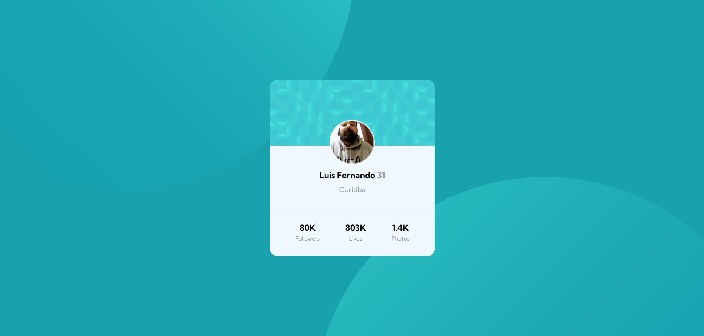

# Frontend Mentor Challenge - Profile Card Component


#### Desafio do site Frontend Mentor, Projeto construido com as ferramentes HTML e CSS.

## Índice

- [Capturas de telas](#capturas-de-telas)
- [Links](#links)
- [Construído com](#construído-com)
- [O que aprendi](#o-que-aprendi)
- [Desenvolvimento contínuo](#desenvolvimento-contínuo)
- [Recursos úteis](#recursos-úteis)
- [Luis Fernando Guimaraes](#autor)

### Capturas de telas

#### Tela Desktop



### Links

- Site URL: https://luis92guimaraes.github.io/profile-card-component/

### Construído com

<div style="display: inline_block"><br>
  
  

### O que aprendi

Esse foi o primeiro projeto que realizei sem ajuda. Foi um projeto que proposto dentro do curso do @Devemdobro e foi muito gratificante finaliza-lo sozinho e ver que estou adquirindo conhecimento real com a programação e que estou evoluindo cada vez mais.

## Trechos de códigos

```
body {
    font-family: 'kumbh sans', sans-serif;
    background: var(--primary-light);
    max-height: 100vh;
    font-size: 18px;
    overflow: hidden;
    position: relative;
}

body::after {
    content: url("../image/bg-pattern-bottom.svg");
    position: absolute; 
    right: -10%;
    bottom: -90%;   
}

body::before {
    content: url("../image/bg-pattern-top.svg");
    position: absolute; 
    left: -15%;
    top: -80%;   
}

```

### Desenvolvimento contínuo

Pretendo continuar focado com os meus estudos e ampliar meus conhecimentos com as ferramentas que venho aprendendo a utilizar a cada dia. Espero com isso colher muitos frutos e resultados positivos.

### Recursos úteis

- [Mdn](https://developer.mozilla.org/en-US/) - O Mozilla Developer Network (MDN) desempenha um papel crucial ao fornecer recursos abrangentes e atualizados para desenvolvedores web em todo o mundo.
- [W3School](https://www.w3schools.com/css/default.asp) - Esse site sempre me ajuda a resolver qualquer problema relacionados a códigos de uma maneira fácil e muito rápida.
- [Dev em Dobro](https://www.youtube.com/@DevemDobro) - Este é um canal onde encontro muito material. Tem muito conteúdo relacionado ao desenvolvimento. Recomendo a todos que querem aprender sobre esse e outros conceitos relacionados.

## Autor

[Luis Fernando Guimarães](https://www.linkedin.com/in/luisfguimaraes/)